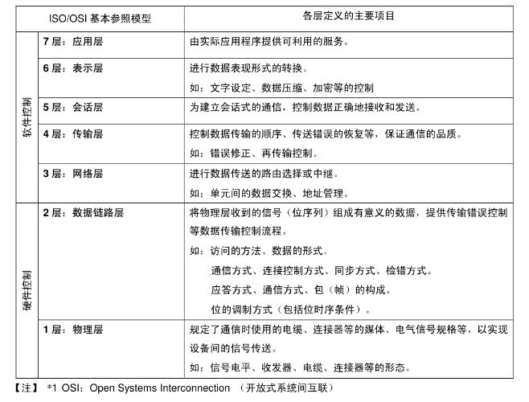

## CAN总线

### 1. 为什么要用CAN

##### CAN通讯协议是什么

​	CAN通讯协议是一种**多主多节点架构**[^1]的**串行通讯协议**[^2] 

[^1]: 多主结构：多个节点都有发起通信的能力，不依赖中心控制；；多节点结构：在这个网络里，每个节点既可以发送信息，也可以接收其他节点发来的信息，
[^2]: （区别于并行通讯协议，并行是同时通过多条数据线传输多个比特，串行是一个接一个传输比特）

可以简单把CAN通信理解成开一场电话会议，

- 当一个人讲话时其他人就听（广播），
- 当多个人同时讲话时则根据一定规则来决定谁先讲话谁后讲话（仲裁）

但值得注意的是，在这场会议中，讲话人会确认听话人是否成功接收信息，如果说话人传递的信息有误，听话人会及时**指出错误**。

##### 特点

- 多主控制
- 通信速度快，距离远
- 具有错误检测、错误通知和错误恢复功能
  - A听出了错误，通知给其他参会人员，演讲人强制闭嘴，不断反复重新叙述，直到说对发出声音
- 故障封闭
  - 判断错误类型是暂时的数据错误（如外部噪声）还是持续的数据错误（如单元内部故障、驱动器故障、断线等），当发生持续数据错误时，将故障的单元从总线上隔离出去
- 多节点结构
- 仲裁机制
  - 采用非破坏性仲裁机制，通过比较消息标识符的优先级来决定哪个节点有权继续发送数据，保证有序性，避免冲突
  - 没有红绿灯的路上让路规则

### 2. CAN协议的分层架构

​	CAN 协议如下图 所示涵盖了 ISO 规定的 OSI 基本参照模型中的传输层、数据链路层及物理层。

#### 2.1 物理层（硬件部分）

​	与I2C、SPI等具有时钟信号的同步通讯方式不同，CAN通讯并不是以时钟信号来进行同步的，它是一种**异步通讯**，只具有 CAN_High 和 CAN_Low 两条信号线，共同构成一组**差分信号线**，以差分信号的形式进行通讯。

- 差分信号中的两根数据线通常是通过**双绞线**布线的，会受到等效干扰，即某一时刻干扰使得一根数据线电压上升20mV，那么同样的干扰也会影响另一根，导致类似的电压变化，而差分信号只依赖于两线之间的电压差，而不是绝对电压值。